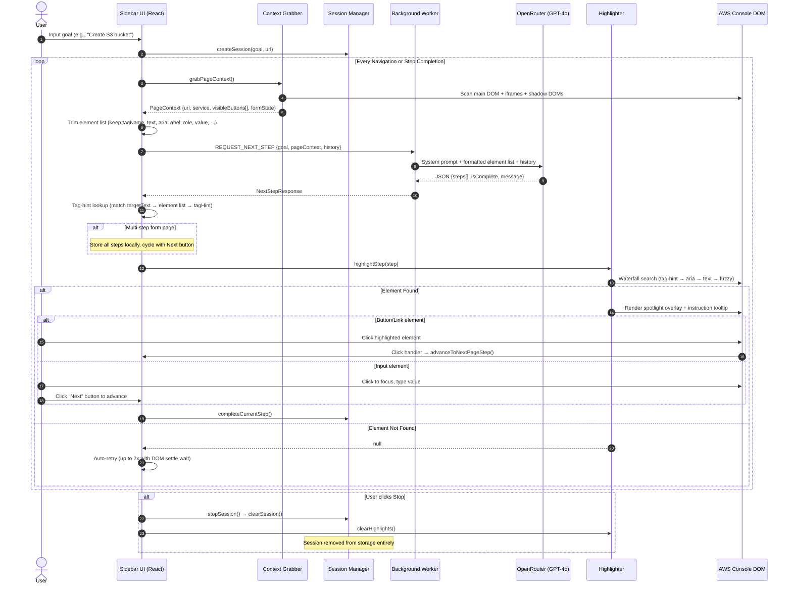

# AWS Navigation Assistant


[](https://opensource.org/licenses/ISC)
[](https://react.dev/)
[](https://www.typescriptlang.org/)
[](https://vite.dev/)
[](https://tailwindcss.com/)
[](https://expressjs.com/)
[](https://openai.com/)

An AI-powered, context-aware browser extension that guides users step-by-step through the AWS Management Console in real-time. It scans live DOM structures — including iframes and Shadow DOMs — and uses an LLM to determine the next action, then highlights the exact UI element the user should interact with.

---

## System Architecture

The project is a monorepo with three packages:

```
.
├── shared/                  # Shared TypeScript types and message constants
│   └── src/index.ts         # InteractiveElement, GuidanceStep, PageContext, etc.
├── extension/               # Chrome Extension (Manifest V3)
│   ├── manifest.json        # Permissions, content script matching patterns
│   ├── background.ts        # Service worker — handles OpenRouter API requests (BYOK)
│   └── content/             # Content scripts injected into AWS Console
│       ├── index.tsx         # Mounts React app into #aws-nav-assistant-root
│       ├── App.tsx           # Main UI — chat widget, session control, step cycling
│       ├── App.css           # Glassmorphism styles, highlight animations
│       ├── content.ts        # Bootstrap, background message handlers
│       ├── contextGrabber.ts # DOM scanner — elements, breadcrumbs, form state
│       ├── highlighter.ts    # Element finder (waterfall) + spotlight overlay
│       ├── navigationWatcher.ts # SPA navigation + visibility detection
│       └── sessionManager.ts # Session CRUD via chrome.storage.session
└── backend/                 # Legacy Express server (deprecated by BYOK architecture)
```

---

## End-to-End Pipeline

### High-Level Flow

```
User enters goal  ──>  Scan page  ──>  Send to LLM  ──>  Get steps  ──>  Highlight element
      ^                                                                        │
      │                    User clicks element or presses "Next"               │
      └────────────────────────────────────────────────────────────────────────┘
```

### Detailed Step-by-Step

#### Phase 1: Context Extraction (`contextGrabber.ts`)

When the user enters a goal (or navigates to a new page during active guidance), `grabPageContext()` builds a full snapshot of the current AWS Console page.

```
grabPageContext()
  ├── waitForPageReady()          # Wait for document.readyState === "complete" + 500ms settle
  ├── parseAWSService(url)        # Map URL to service name (e.g. "/s3/" → "S3")
  ├── captureBreadcrumb()         # Extract breadcrumb trail from navigation elements
  ├── captureFormState()          # Capture active tabs, open modals, filled form fields
  ├── deriveView()                # Determine the current view/section
  └── scanAndRankElements()       # The core element scanner
        ├── collectFromRoot(document)       # Main document: a, button, input, select, textarea
        ├── collectFromShadowRoots(body)    # TreeWalker finds awsui-* shadow roots
        └── collectFromIframes()            # Same-origin iframes (+ nested iframes)
              └── For each iframe:
                    ├── collectFromRoot(iframeDoc)
                    └── collectFromShadowRoots(iframeDoc.body)
```

**Element processing** (`processElement`):

- Filters out extension UI, hidden elements, disabled elements, `aria-hidden` elements
- Captures: `tagName`, `text` (via `getLabel`), `ariaLabel`, `role`, `selector`, `isVisible`
- For inputs: additionally captures `value`, `placeholder`, `inputType`, `name`

**Input label resolution** (`findInputLabel`) — priority order:

1. `aria-labelledby` (resolved via `getRootNode()` for shadow DOM support)
2. `aria-label`
3. `<label for="id">` association
4. Parent `<label>` elements (up to 4 levels)
5. `name` attribute
6. `placeholder` attribute

Output format: `[input: Bucket name]`, `[textarea: Description]`, `[dropdown: Region]`

#### Phase 2: LLM Request (`App.tsx` → `background.ts` → `OpenRouter`)

```
App.tsx                          background.ts                    OpenRouter API
  │                                │                                │
  ├─ Trim element list             │                                │
  │  (keep: tagName, text,         │                                │
  │   ariaLabel, role, value,      │                                │
  │   placeholder, inputType,      │                                │
  │   name)                        │                                │
  │                                │                                │
  ├─ Build NextStepRequest ──────> │                                │
  │  {goal, pageContext,           ├─ POST https://openrouter.ai/ ─>│
  │   history, sessionId}          │                                │
  │                                │                                ├─ LLM processes prompt
  │                                │                                │
  │                                ├─ Parse structured JSON         │
  │  <──────────────────────────── ├─ Return NextStepResponse       │
  │                                │    {steps[], isComplete}       │
  │                                │                                │
```

**LLM prompt rules**:

- For **form pages**: return ALL fields + submit button as separate steps
- For **navigation pages**: return a single step
- `targetText` must exactly match an element's text from the provided list
- `targetText` capped at 60 characters
- Never invent element names — only use what's in the element list
- Loop detection: if last 6 steps repeat, prompt warns to choose a different path

#### Phase 3: Tag-Hint Matching (`App.tsx`)

After receiving the LLM response, each step's `targetText` is looked up in the element list that was sent to the LLM:

```
LLM returns:  { targetText: "S3", ... }
                    │
                    ▼
Look up "s3" in pageContext.visibleButtons
                    │
                    ▼
Found match:  { tagName: "a", text: "S3", selector: "[data-testid='s3-link']" }
                    │
                    ▼
Enrich step:  step.tagHint = "a"
              step.selectorHint = "[data-testid='s3-link']"
```

This gives the highlighter a deterministic search path — it knows the exact HTML tag to look for, not just the text.

#### Phase 4: Element Finding & Highlighting (`highlighter.ts`)

The highlighter uses a **10-strategy waterfall** to find the target element:

| Priority | Strategy             | Description                                                                                |
| -------- | -------------------- | ------------------------------------------------------------------------------------------ |
| 0        | **Tag hint**         | Search by `tagHint` tag + matching text (deterministic, from element list lookup)          |
| —        | **Input match**      | For `[input:...]`, `[textarea:...]`, `[dropdown:...]` prefixes — scored attribute matching |
| 1        | Exact aria-label     | Main DOM + shadow DOM traversal                                                            |
| 2        | Exact text           | Collapsed whitespace text match, with `pickBestCandidate` for disambiguation               |
| 3        | Data analytics       | `data-analytics-metadata` attribute match                                                  |
| 4        | Contains aria-label  | Substring aria-label matching                                                              |
| 5        | Contains shadow text | Shadow DOM substring text search                                                           |
| 6        | Scored text          | Weighted scoring: tag type, child count, size, viewport position, sidebar penalty          |
| 7        | CSS selector         | Direct selector from `selectorHint` or `targetSelector`                                    |
| 8        | Word boundary        | Key word overlap (60%+ threshold)                                                          |
| 9        | Fuzzy text           | Levenshtein distance <= 3                                                                  |

Each strategy searches across: main document → same-origin iframes → shadow DOMs.

**Element disambiguation** (`pickBestCandidate`): when multiple elements match, scoring considers:

- Child count (fewer = more specific, +points)
- Element size (link-sized elements preferred over large containers)
- Viewport position (visible elements preferred)
- Tag type (`<a>`, `<button>` get +15)
- Sidebar penalty (-40 for nav/aside/sidebar ancestors)
- Text length proximity to target

**Iframe coordinate correction** (`getAbsoluteRect`): elements inside iframes return iframe-relative coordinates from `getBoundingClientRect()`. The method detects the parent iframe and adds its offset to produce page-absolute coordinates for the spotlight overlay.

#### Phase 5: Spotlight Overlay

Once the element is found:

1. **Scroll** — smart scroll handles nested scrollable containers, then viewport scroll
2. **Overlay** — fixed-position overlay with:
   - Cyan border box with pulsing glow animation around the target
   - Dark backdrop (`box-shadow: 0 0 0 9999px rgba(0,0,0,0.6)`) with spotlight cutout
   - Instruction tooltip positioned above/below/right with arrow indicator
3. **Click detection** — for buttons/links: click on the element auto-advances to next step
4. **Input handling** — for input/textarea/select: click focuses the field for typing; user presses "Next" button to advance

#### Phase 6: Multi-Step Page Cycling

For form pages, the LLM returns multiple steps in a single response:

```
Page: "Create S3 Bucket"
Steps returned: [
  { targetText: "[input: Bucket name]",  instruction: "Enter a bucket name" },
  { targetText: "Create bucket",          instruction: "Click Create bucket" }
]
```

These are cycled locally in `App.tsx` without additional LLM calls:

- `pageSteps[]` holds all steps for the current page
- `pageStepIndex` tracks position
- "Next" button appears when `pageSteps.length > 1`
- After the last page step is completed, the extension requests the next step from the LLM

### Session Lifecycle

```
createSession(goal)        # User enters goal → new session in chrome.storage.session
     │
     ▼
  "active"  ──────────────>  requestNextStep()  ──>  highlight  ──>  user acts  ──>  loop
     │                                                                    │
     ├── Tab switch away ──>  "paused"  ──>  Tab return ──>  auto-resume back to "active"
     │
     ├── User clicks Stop ──>  clearSession()  ──>  session removed from storage entirely
     │                         (navigation watcher sees null session, does nothing)
     │
     └── LLM says isComplete ──>  "completed"  ──>  clear highlights, show success message
```

**Key design decision**: `stopSession()` removes the session from `chrome.storage.session` entirely (not just a status flag). This prevents race conditions where the navigation watcher reads stale session state and triggers unwanted LLM calls after the user stops guidance.

---

## Interaction Diagram



---
## Demo video

https://github.com/user-attachments/assets/84ed96f3-3ca9-445c-8135-3fce382e4057


## Tech Stack

### Frontend & Extension

- **Framework:** React 19 (TypeScript)
- **Build Tool:** Vite 7 with Fast Refresh
- **Styling:** TailwindCSS v4 & Custom CSS (glassmorphism, pulse animations)
- **Icons:** Lucide React
- **Environment:** Chrome Extensions Manifest V3
- **LLM Provider:** OpenRouter (Direct integration via BYOK architecture)

### Backend Service (Deprecated)

- The legacy Express backend service is no longer required. The extension uses a BYOK (Bring Your Own Key) architecture to communicate directly with OpenRouter via the background service worker.

### Shared Library

- **Package Type:** ES Modules
- **Compilation:** `tsc` to `dist/` with declarations

---

## Setup & Installation

### Prerequisites

- Node.js v18+
- npm v10+
- An [OpenRouter API Key](https://openrouter.ai/)

### 1. Clone & Install

```bash
npm run install:all
```

### 2. Start Development

```bash
npm run dev:extension
```

This starts the extension bundler via Vite (output to `extension/dist`).

### 3. Load in Chrome

1. Navigate to `chrome://extensions/`
2. Enable **Developer mode**
3. Click **Load unpacked** and select the `extension/dist` folder
4. Open any [AWS Console](https://console.aws.amazon.com/) page
5. Click the floating **AWS Navigator** button
6. Click the settings icon inside the extension to input your OpenRouter API Key (BYOK).

### Rebuilding Shared Types

After changing `shared/src/index.ts`:

```bash
cd shared && npm run build
```

---

## Contribution Guidelines

### Development Workflow

1. **Branch naming:** `feature/shadow-dom-inputs`, `bugfix/loop-detection-retry`
2. **Type integrity:** Types shared between packages go in `shared/src/index.ts`. Run:
   ```bash
   npm run type-check
   ```
3. **Coding standards:**
   - Use established log prefixes: `[Highlighter]`, `[ContextGrabber]`, `[App]`, `[SessionManager]`, `[Background]`
   - Write defensive DOM selectors — never crash the AWS Console
   - Test against at least one AWS service console (S3, EC2, IAM)

### Submitting a PR

```bash
npm run build:backend && npm run build:extension
git commit -m "feat(highlighter): add tag-hint deterministic matching"
```

Push and submit a PR to main. Describe the change and which AWS service console you tested against.
