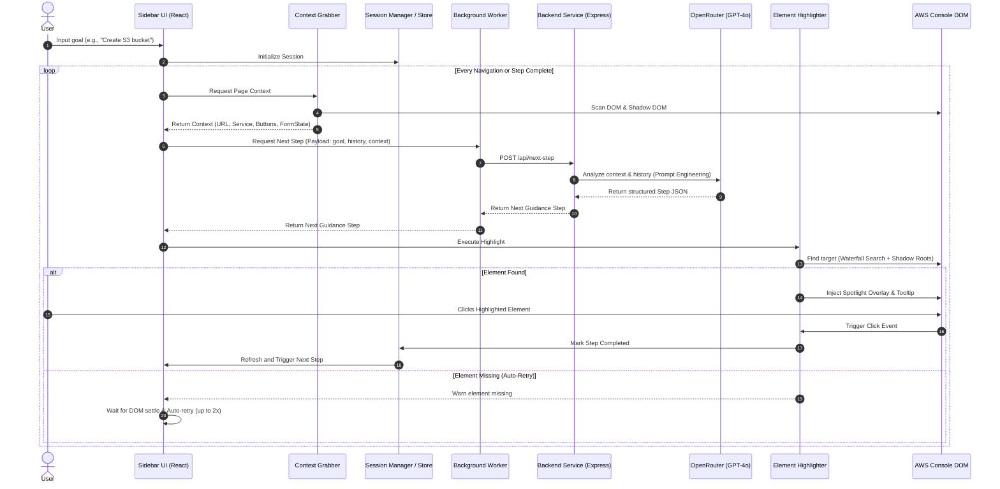

#  AWS Navigation Assistant

[](https://opensource.org/licenses/ISC)
[](https://react.dev/)
[](https://www.typescriptlang.org/)
[](https://vite.dev/)
[](https://tailwindcss.com/)
[](https://expressjs.com/)
[](https://openai.com/)

An AI-powered, context-aware browser extension that guides users step-by-step through the AWS Management Console in real-time. By analyzing live DOM structures (including Shadow DOMs) and using a robust waterfall element matcher, the assistant highlights exact UI controls to help users accomplish complex AWS workflows.

---

##  System Architecture

The project uses a monorepo workspace architecture containing three main packages:
1. **`extension`**: A Manifest V3 Chrome Extension containing content scripts, background workers, and a React floating chat interface.
2. **`backend`**: An Express server proxying LLM requests, implementing validation and loop-detection.
3. **`shared`**: Shared TypeScript types, state interfaces, and messaging protocols.

### System Interaction Diagram



---

##  Tech Stack

### Frontend & Extension
*   **Framework:** React 19 (TypeScript)
*   **Build Tool:** Vite 7 with Fast Refresh
*   **Styling:** TailwindCSS v4 & Custom CSS (Glassmorphism & Interactive micro-animations)
*   **Icons:** Lucide React
*   **Environment:** WebExtensions / Chrome Extensions (Manifest V3)

### Backend Service
*   **Framework:** Express 5 (TypeScript)
*   **Runtime:** Node.js with `tsx` (TypeScript Execute) for hot-reloading development
*   **API Client:** Axios
*   **LLM Provider:** OpenRouter (accessing `openai/gpt-4o` for zero-shot step generation)
*   **Configuration:** dotenv

### Shared Library
*   **Package Type:** ES Modules
*   **Compilation:** `tsc` (TypeScript Compiler) compiling to `dist/` declarations and JavaScript

---

##   Core Technical Features

### 1. Robust Waterfall Element Search (`highlighter.ts`)
AWS Management Console elements are difficult to target due to dynamic CSS classes, deep nesting, and extensive use of Shadow DOM components (e.g., `<awsui-button>`). The highlighter uses a prioritized **9-layer waterfall search strategy**:
1.  **Exact `aria-label` Match** (checks main DOM and traverses shadow trees).
2.  **Exact Text Match** (normalizes/collapses nested space and spans).
3.  **Analytics Metadata Match** (`data-analytics-metadata` attribute inspection).
4.  **Fuzzy `aria-label` Contains** matching.
5.  **Fuzzy Shadow DOM Text Contains** matching.
6.  **Scored Text Match** (heavily penalizes sidebar headers, container nodes, and wraps).
7.  **CSS Selector Fallback** (utilizes structural selectors).
8.  **Word-Boundary Match** (analyzes key verb/nouns e.g., "Launch instances" vs "Launch instance").
9.  **Levenshtein Distance Fuzzy Match** (string edit distance threshold ≤ 3).

### 2. Context Extraction (`contextGrabber.ts`)
Before calling the LLM, the extension crawls the page to construct a comprehensive state snapshot:
*   **Metadata:** Document Title, URL, parsed AWS Service name (e.g., S3, EC2), and Section View.
*   **Navigation:** Breadcrumbs history list.
*   **Interactives:** Scrape all visible buttons, anchor links, and standard input roles.
*   **Forms:** Key-value map representing the current state of active text inputs, checkboxes, and select dialogs.

### 3. Session Persistence & Auto-Resume
Guidance sessions are saved in `chrome.storage.session` and synchronized with the background thread.
*   **SPA Watcher:** Detects address-bar modifications and dynamic router updates.
*   **Auto-Pause:** If the user opens another tab or navigates away from the guided flow, the helper pauses itself.
*   **Auto-Resume:** Re-focusing the AWS console tab or returning to the step URL automatically resumes guidance and restores the overlay spotlight.

---

##  Setup & Installation

### Prerequisites
*   Node.js (v18+)
*   npm (v10+)
*   An [OpenRouter API Key](https://openrouter.ai/)

### 1. Clone & Install Dependencies
From the repository root, run the setup script to install dependencies across the monorepo:
```bash
# Installs workspace dependencies + package dependencies recursively
npm run install:all
```

### 2. Configure Environment Variables
Create a `.env` file in the `backend/` folder:
```bash
cp backend/.env.example backend/.env
```
Open `backend/.env` and insert your OpenRouter credentials:
```env
PORT=3000
NODE_ENV=development
OPENROUTER_API_KEY=your_openrouter_api_key_here
OPENROUTER_SITE_URL=http://localhost:3000
OPENROUTER_SITE_NAME="AWS Navigator"
```

### 3. Start Development Servers
Run the full environment concurrently:
```bash
npm run dev
```
This command starts:
*   The Express backend on `http://localhost:3000` (with TSX watcher).
*   The Extension bundler on Vite watcher (outputting build bundles into `extension/dist`).

### 4. Load the Extension in Chrome
1.  Open Chrome and navigate to `chrome://extensions/`.
2.  Enable **Developer mode** in the top right corner.
3.  Click **Load unpacked** in the top left.
4.  Select the **`extension/dist`** folder from this project directory.
5.  Open any page on [AWS Console](https://console.aws.amazon.com/) (e.g., S3 console). Click the floating **AWS Navigator** toggle button to open the assistant.

---

##  Contribution Guidelines

If you wanna contribute go through the below steps:

### Development Workflow
1.  **Branch Naming:** Create a branch named after the feature or bug you are working on, e.g., `feature/shadow-dom-inputs` or `bugfix/loop-detection-retry`.
2.  **Type Integrity:** Ensure types are defined in `shared/src/index.ts` if they are passed between components. Run type-checks before pushing:
    ```bash
    npm run type-check
    ```
3.  **Coding Standards:**
    *   Maintain documentation integrity. Do not modify or delete unrelated JSDocs/comments.
    *   Ensure all new helper utilities are covered with logs (`console.log`, `console.warn`) following the established prefix convention (e.g. `[Highlighter]`, `[Content]`, `[App]`).
    *   Write defensive DOM selectors to avoid crashing the AWS console if markup deviates.

### Submitting a Pull Request
1.  Make sure your code compiles and builds successfully:
    ```bash
    npm run build:backend && npm run build:extension
    ```
2.  Commit your changes with meaningful commit messages:
    ```bash
    git commit -m "feat(highlighter): add support for shadow-rooted inputs"
    ```
3.  Push to your fork and submit a Pull Request to the main branch. Explain the change and describe what AWS service console you tested the change against.
